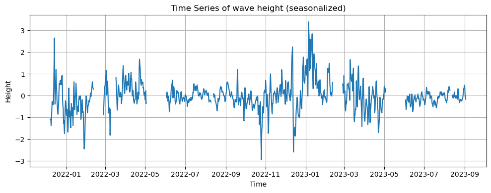
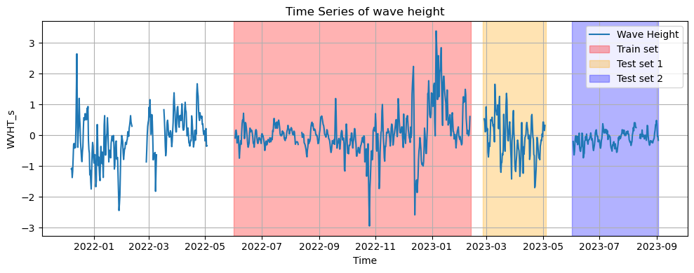
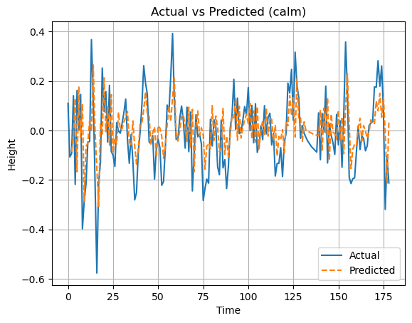
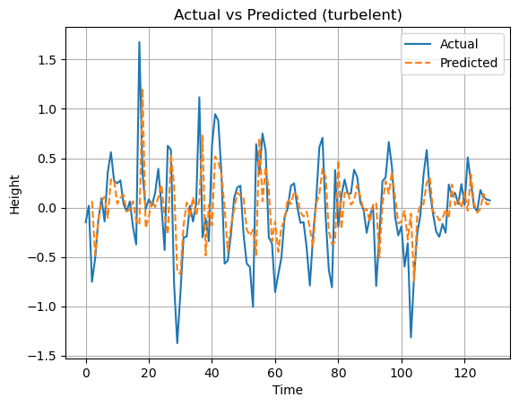
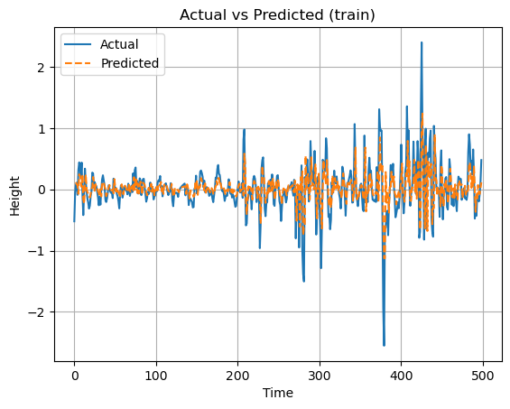

# Modeling Wave Height Dynamics – An Econometric Approach

This independent project models the behavior of **significant wave height** using econometric tools, with a focus on identifying and capturing seasonal patterns and long-memory processes.

---

## Data

The dataset comes from the [NOAA National Data Buoy Center (NDBC)](https://www.ndbc.noaa.gov/) – specifically from **Station 46269 (Point Santa Cruz, California)**.  
The analysis covers the years **2020–2023**.

---

## Data Cleaning

The raw data was **noisy, incomplete, and irregular**. The cleaning process involved several steps:

1. **Handling Missing Samples**  
   - The dataset contained both large gaps and single-sample gaps.  
   - **Large gaps**: left as-is.  
   - **Medium gaps**: filled using **linear interpolation**.  
   - **Small gaps**: filled using a **moving average (MA)** filter.  
   - Continuous data is essential for time series modeling, so gap treatment was a priority.

2. **Seasonality Adjustments**  
   - **Yearly seasonality**: Adjusted by subtracting each observation from the value recorded exactly one year earlier.  
   - **Tidal seasonality**: The tidal cycle is ~24.2 hours, while the dataset has a 30-minute frequency.  
     - Used **Fourier terms** (`sin` and `cos`) in a regression to estimate the tidal component.  
     - Subtracted the estimated tidal pattern from the data.

3. **Frequency Aggregation**  
   - Converted the data from **0.5-hourly** to **12-hourly** intervals.  
   - Aggregation was done by averaging within each 12-hour window.  
   - This reduced noise and computational cost.

---

## Modeling

1. **Preliminary Analysis**  
   - Examined **PACF** and **ACF** plots.  
   - Data exhibited **long-memory behavior** and very small PACF coefficients.  
   - Conducted **Augmented Dickey–Fuller (ADF) test** → stationarity was rejected.

2. **Train–Test Split**  
   - Used the longest continuous segment as the **training set**.  
   - Test data consisted of **two disjoint periods** with different statistical behaviors.

3. **Model Selection**  
   - Chose an **ARFIMA(p, d, q)** model due to long-memory characteristics.  
   - Implemented **fractional differencing** before estimation.  
   - Performed a **grid search** over multiple `p` and `d` values.  
   - Selected the model with the lowest **AIC** and **BIC** → **ARFIMA(2, 0.5, 0)**.

4. **Results**  
   - Model applied to training and both test sets.  
   - Predictions were generated using the previous two actual samples.

  
  

---

## Summary

This project demonstrates the application of **econometric modeling techniques** to environmental time series data.  
The cleaning process addressed irregular sampling and multiple seasonalities, while ARFIMA modeling captured the long-memory nature of wave height dynamics.

