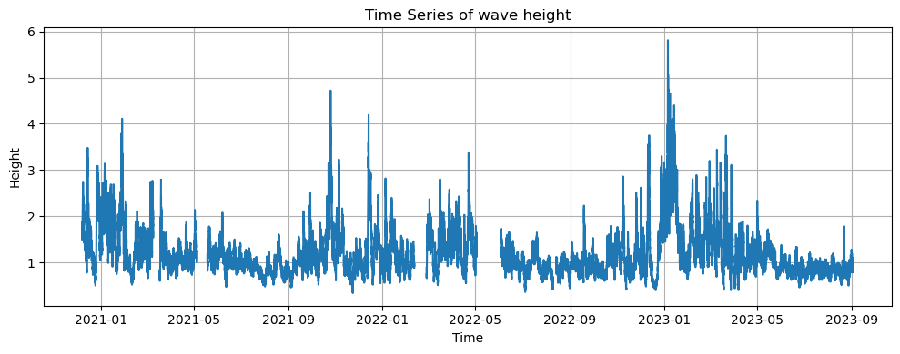

This is an independet project to model the behaviour of wave height, we'll use econometrical tools for that analysis.

### data
The data is taken from [NOAA NDBC]([https://www.ndbc.noaa.gov/station_page.php?station=46269](https://www.ndbc.noaa.gov/)) and more specifically - from station 46269 – Point Santa Cruz
The data i'll use will be data from 2020-2023

### data cleaning
The raw data was really noisy and dirty so i cleaned it and did some adjustments

Cleaning - there were alot of missing samples along the way, some of them made big gaps and some 1 sample gap, in time series analysis it's very problematic to work with non continous data. 
For the big gaps, i left them as is, for the medium gaps, i used techinques like linear interpolation, and for the small ones i used MA to fill in.

Next, i adjusted for seasonality effects, the affects we have are yearly seasonality and tidal seasonality.
For adjusting yearly seasonality i just looked at the diffrence between each sample and the previous's year sample. For the tidal seasonality, i couldnt use simple techniques because the tidal cycle is one of 24.2 hours, and my data was with freq of 0.5. so i used fourier terms for time in regression to estimate the pattern and then adjusted according to it

lastly, i adjusted the frequency from 0.5 hours to 12 hours, which helped both computationally and made the data less noisy, i did it by averaging each 12 hours.

*picture of claen data*

## modeling

For modeling, i first checked the PACF and ACF functions, since the data showed a long memory behaviour, while having very small coefficients for the PACG function, i checked with ADF test for stationarity, and rejected it.
Since the data had big gaps i used them as train-test data sets, where my longest continous part was the train, and for test i used 2 other parts which behaved very differently from each other.

*picture of train-test*

I went with an ARFIMA(ar, d, 0) models, for model selection i did a grid search over multiple ar and d combinations. to adjust the data for ARFIMA i also implemented fractional diffrencing before estimating. For model selection i picked the model with lowest AIC and BIC, the chosen model was ARFIMA(2,0.5,0).

Then i used my model on the train adtasets, estimating each sample base on the previous 2 (real, not predicted) samples.

*picture of prections*

